# LINE公式アカウントの作成と設定

本ページでは、LINE Botを制作するために必要なLINE公式アカウント（以下、公式アカウント）の作成と、公式アカウントにMessaging APIの設定を行う手順を説明します。

- [LINE公式アカウントの作成と設定](#line公式アカウントの作成と設定)
  - [全体の流れ](#全体の流れ)
  - [LINE Official Account Manager](#line-official-account-manager)
  - [1. LINEビジネスIDへのログイン](#1-lineビジネスidへのログイン)
  - [2. 公式アカウントの作成](#2-公式アカウントの作成)
  - [3. Messaging APIの設定](#3-messaging-apiの設定)
  - [4. 応答設定](#4-応答設定)

## 全体の流れ

今回行う手順は、次のような流れです。

1. LINEビジネスIDへのログイン
2. 公式アカウントの作成
3. Messaging APIの設定

これらはWebサイトの画面にしたがって一本道で進めていくだけなので、とくに難しいことはありません。本ページでじっくりと進めていきましょう。

> 📝**補足メモ**  
> 以下は、2024年9月4日の仕様変更以前からMessaging APIを利用している方への補足です。
> 
> 以前は「LINE Developers」コンソールから「チャネルの作成」によりMessaging APIの作成を行うことができましたが、仕様変更以降はその手順ではMessaging APIを作成できなくなりました。
>
> 正確には、作成はできるもののWebサイトを行ったり来たりするため、少しややこしくなっています。そのため、本記事では「LINE Developers」コンソールからではなく「LINE Official Account Manager」から作成する新しいやり方を解説しています。

🗒️**参考**  
[Messaging APIを始めよう | LINE Developers](https://developers.line.biz/ja/docs/messaging-api/getting-started/#using-console:embed:cite)

🗒️**参考**  
[2024年9月4日をもってLINE DevelopersコンソールからMessaging APIチャネルを直接作成することはできなくなりました | LINE Developers](https://developers.line.biz/ja/news/2024/09/04/no-longer-possible-to-create-messaging-api-channels-from-console/)

## LINE Official Account Manager

公式アカウントの作成は、PCのブラウザで「LINE Official Account Manager」を開いて行います。

これは公式アカウントを管理・運営するための管理者向けのWebサイトです。

[LINE Official Account Manager](https://manager.line.biz/)

では、さっそくやっていきましょう。

## 1. LINEビジネスIDへのログイン

[LINE Official Account Manager](https://manager.line.biz/)を開くと、最初は「LINEビジネスID」へのログインが求められます。

LINEビジネスIDは公式アカウントを運用するための管理画面にログインするためのIDです。これには個人のLINEを用いてログインできます。

「LINEアカウントでログイン」をクリックしましょう。

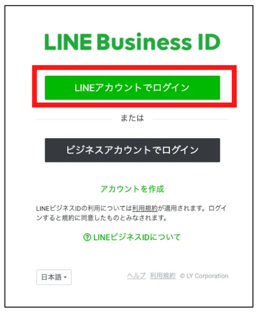

メールアドレスとパスワードを入力してログインすることもできますが、ここでは下の方の「QRコードログイン」をクリックしてみましょう。

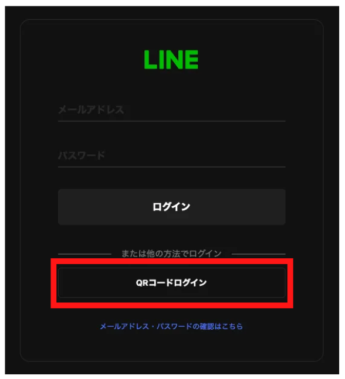

すると、PC画面にQR画像が表示されます。

手持ちのスマホでLINEアプリを開き、友だち登録用のQRリーダーを起動して読み取りましょう。

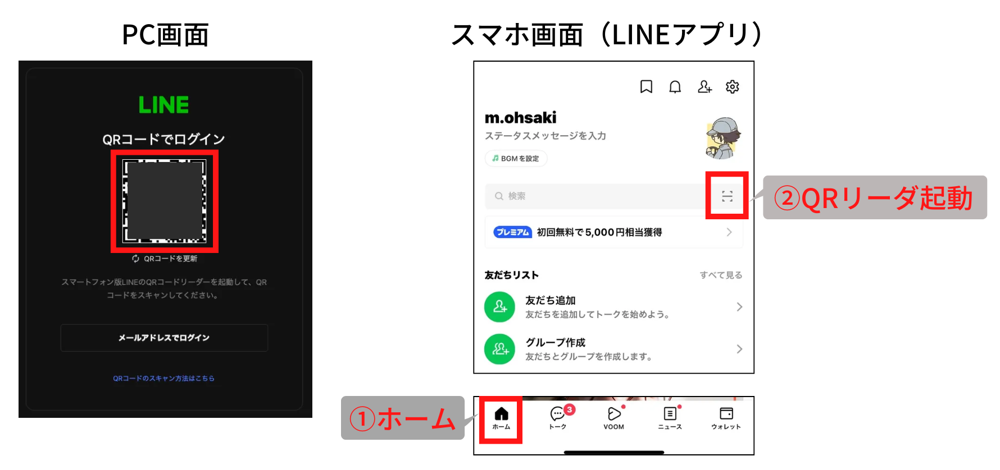

PC画面が自動で変わり、4桁の認証番号が表示されます。スマホのLINEアプリの画面に沿って、暗証番号の入力を進めてください。

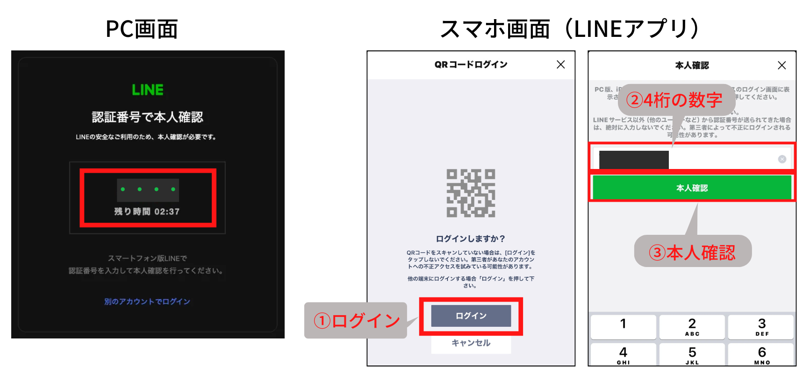

最後にアカウントの確認画面になるので、「LINEビジネスIDを作成」をクリックすればOKです！

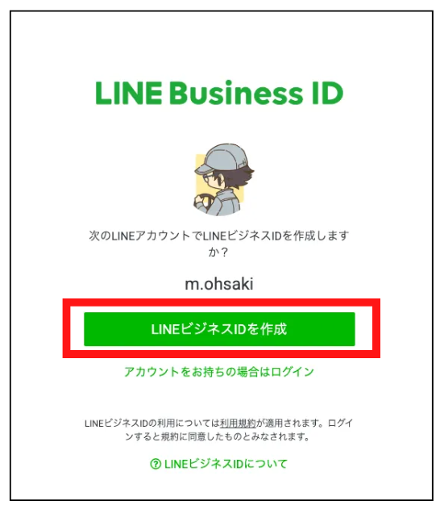

ログインが成功すると、下記のような「アカウントリスト」の画面になります。最初はまだアカウントを作成していないので、リストには何も表示されません。すでに公式アカウントを作成して運用している人は、ここに表示されているはずです。

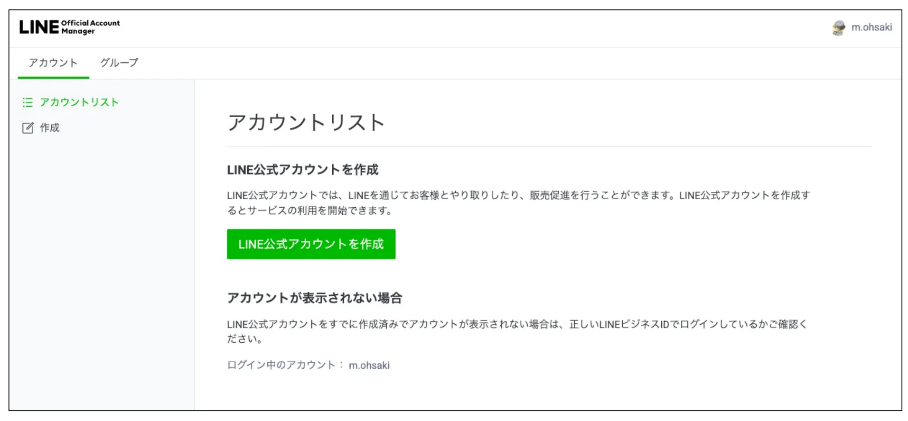

## 2. 公式アカウントの作成

左のメニューバーから「作成」をクリックして、公式アカウントの作成を進めていきましょう。

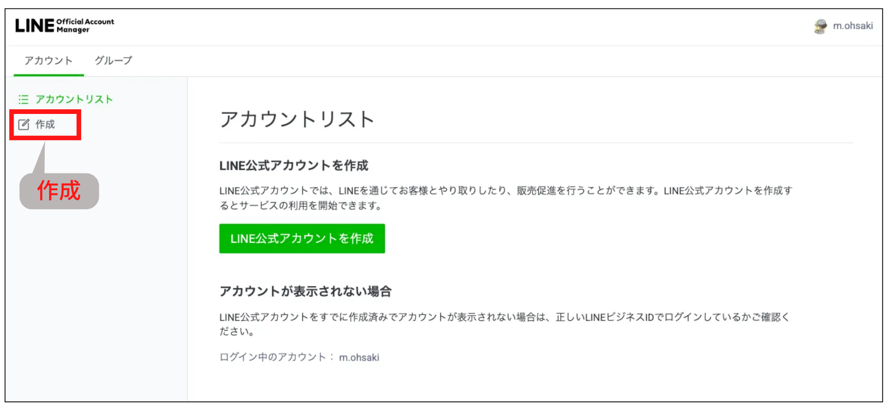

まずは、アカウントの情報を登録します。下記画像の赤枠部分が必須事項となりますので、画像を参考に入力してみてください。

ここで「アカウント名」は友だち登録時に表示される名前になるので重要です（あとから変更も可能です）。入力を終えたら、規約を確認して最下部の「確認」をクリックします。

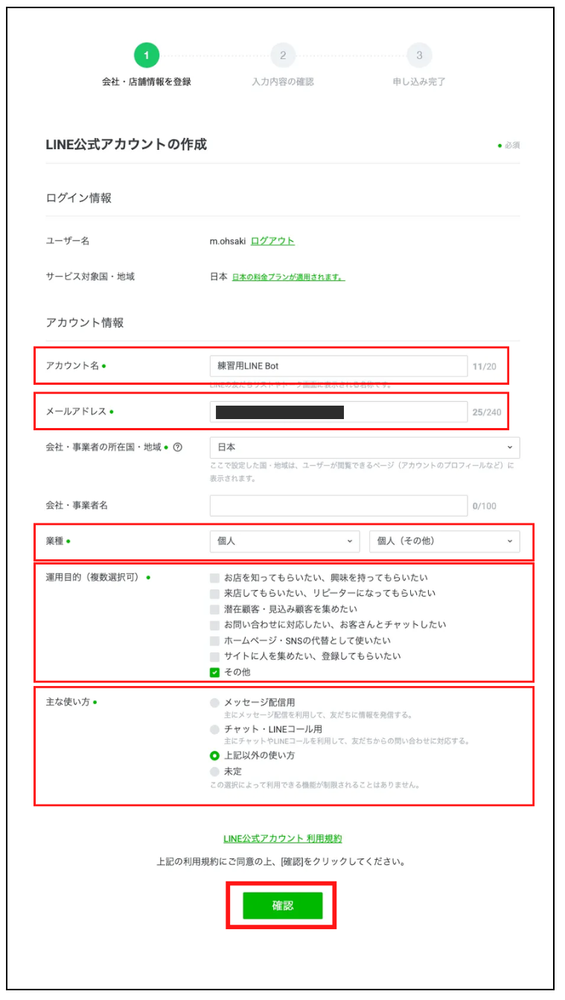

次に、入力内容の確認です。下部のチェックボックスは任意で外して大丈夫です。入力内容に間違いがなければ「完了」をクリックします。

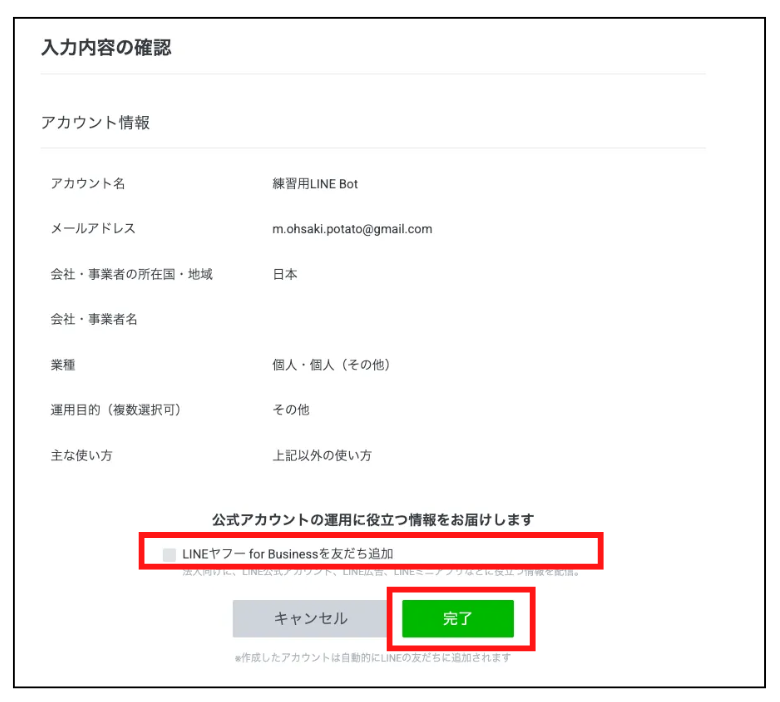

緑色の「LINE Official Acount Managerへ」のボタンをクリックし、先へ進みます。

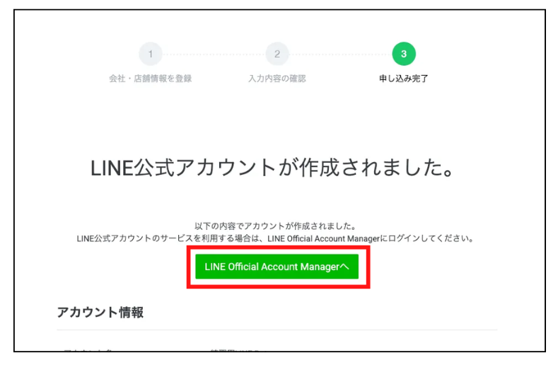

この後、LINEヤフー株式会社との「同意について」の文章が2つ出てきますので、確認して「同意」をクリックして進めてください。

すると最後に、下記のようなポップアップが出てきます。ひとまず「①次へ」「②ホーム画面に移動」の順にクリックして消しちゃいましょう。

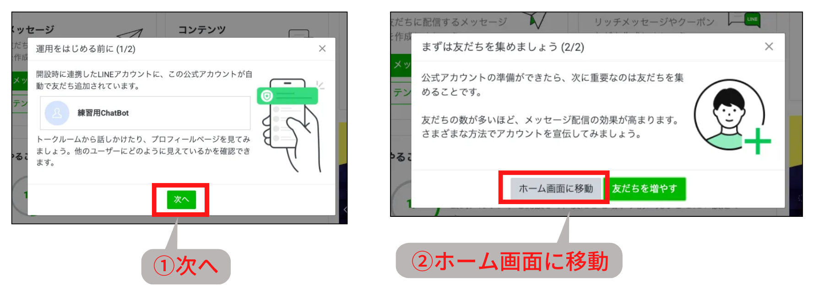

下記の画面になれば、公式アカウントの作成は完了です！

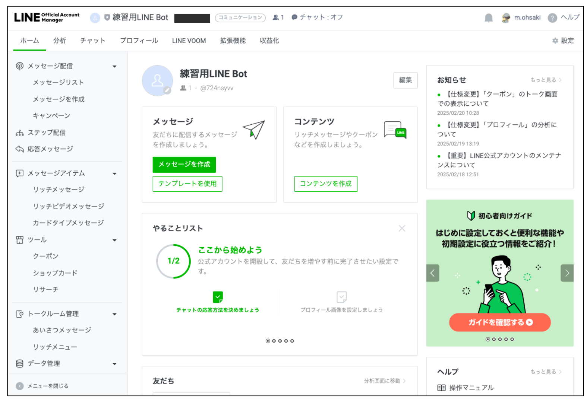

手持ちのスマホでLINEのトークを確認すると、作成したアカウントが自動で友だち登録されているはずです。確認してみましょう。

## 3. Messaging APIの設定

さて、ここまできたらあともう一息です。もう少しだけ、がんばっていきましょう。

ホーム画面右上の「①設定」をクリックし、公式アカウントの設定画面に移動します。

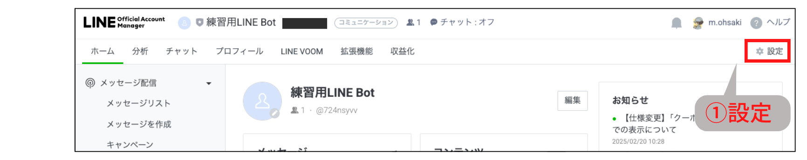

左側メニューから「②Messaging API」を選択し、緑色の「③Messaging APIを利用する」ボタンをクリックします。

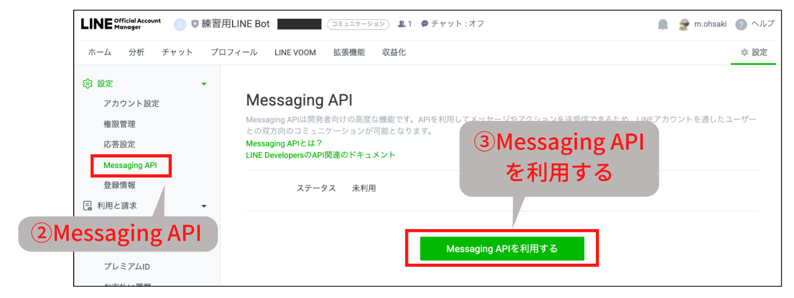

すると、開発者情報を登録する画面が出てきます。名前とメールアドレスを入力し、規約を確認し「同意する」をクリックしましょう。次の確認画面でも情報が間違っていなければ「OK」をクリックして先へ進みます。

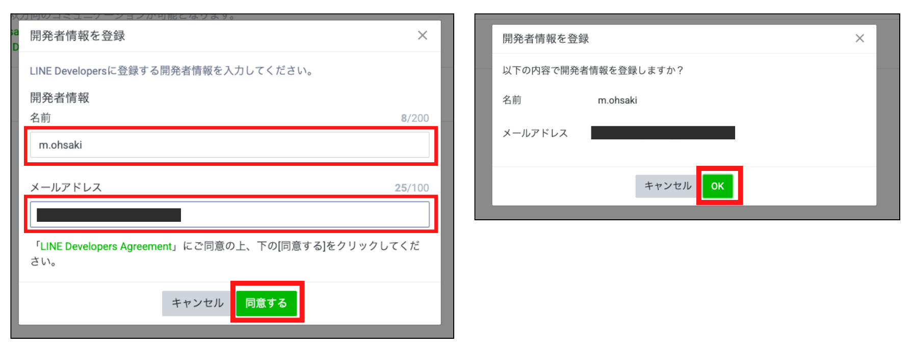

次に、プロバイダーを選択する画面が出てきます。はじめての場合は「プロバイダーを作成」欄に名前を入力し、規約を確認したら「同意する」をクリックしましょう。もし既にプロバイダーを作成済みの場合は、それを選択して先に進めても構いません。

> 📝**補足メモ**  
> プロバイダーとは、公式アカウントを運用する提供者（組織や企業）という意味です。複数のアカウントを管理するための「グループ」のようなものをイメージしてください。1つのLINEビジネスIDで複数の公式アカウントを運用する場合、目的や部門別にプロバイダーを分けて管理することができます。ただし、アカウントに一度設定したプロバイダーは後から変更できないので、注意が必要です。

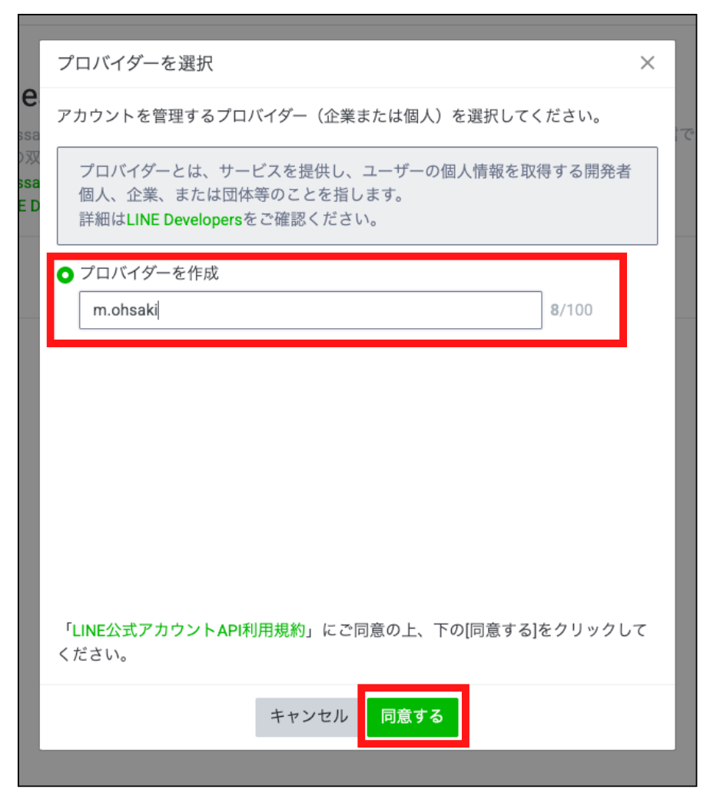

次に、プライバシーポリシーと利用規約を登録する画面が出てきますが、入力は任意なのでそのまま「OK」をクリックしましょう。次の確認画面でも問題なければ「OK」をクリックし、プロバイダーを作成します。

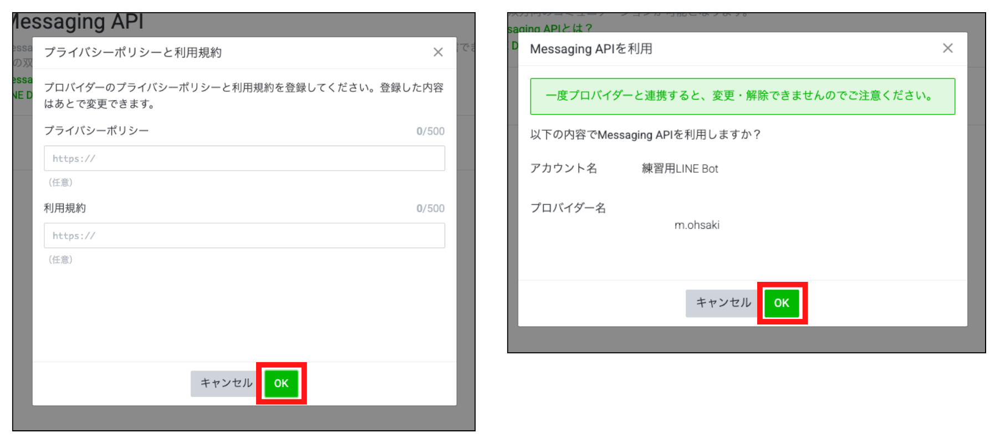

下記のような画面になれば、Messaging APIの設定は完了です。

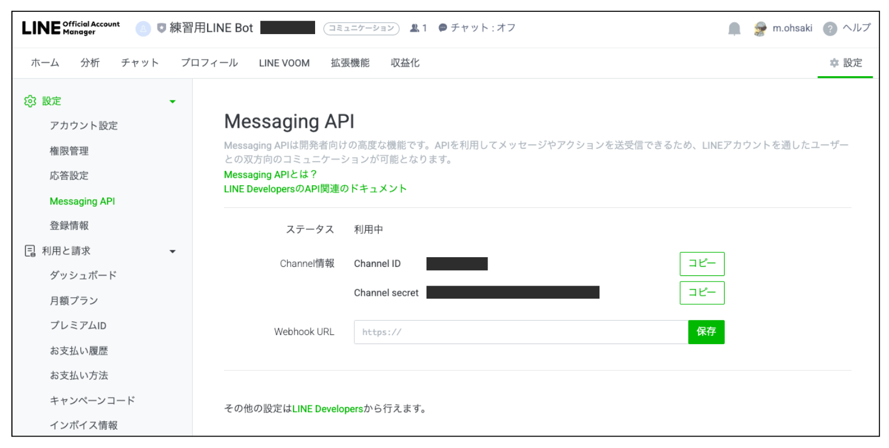

## 4. 応答設定

最後に、もうひとつだけ設定をしておきましょう。

さきほどの続きで、公式アカウントの設定画面の左側メニューから「①応答設定」を選択します。そして「②応答メッセージ」のトグルスイッチをクリックし、OFFにしておきます。

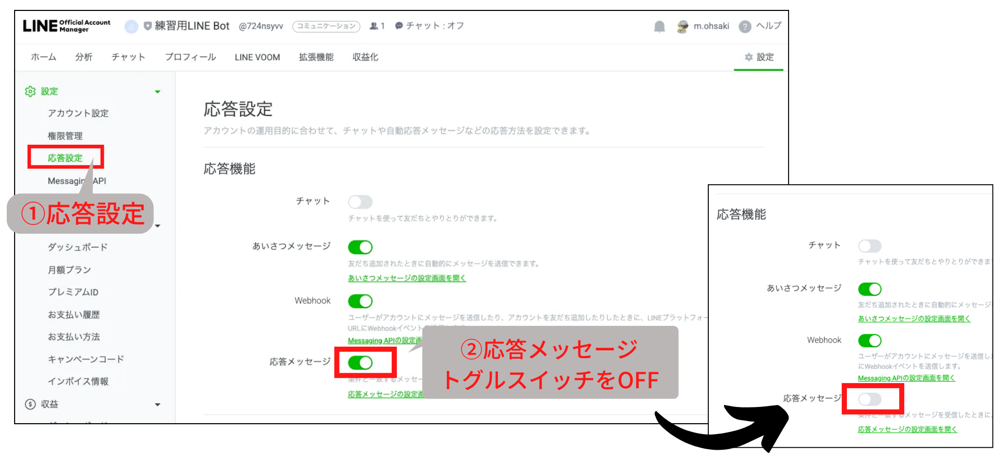

この「応答メッセージ」は、公式アカウントにメッセージを送信したときに自動で定型文を返す機能です。LINE Botを制作する場合はこれがONのままだと不都合が生じるので、忘れずにOFFにしておきましょう。

以上で、すべての設定が完了です。おつかれさまでした！
