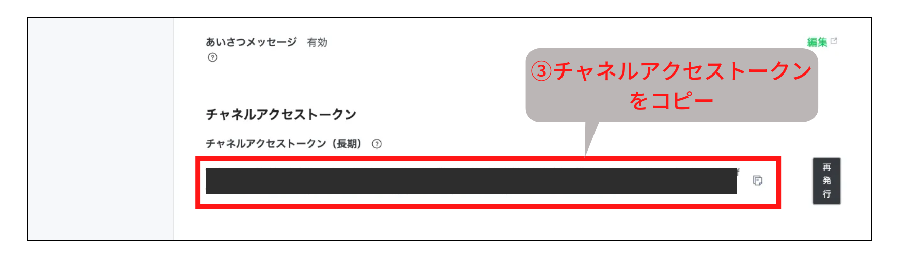

# LINE Bot制作に必要なトークン取得とWebhookの設定

本ページでは、Messaging APIを使ってLINE Botを制作するために必要な、ユーザーIDとチャネルアクセストークンの取得、そしてWebhook URLを設定する方法を説明します。

- [LINE Bot制作に必要なトークン取得とWebhookの設定](#line-bot制作に必要なトークン取得とwebhookの設定)
  - [LINE Developersコンソール](#line-developersコンソール)
  - [1. 自身のユーザーIDとチャネルアクセストークンの取得](#1-自身のユーザーidとチャネルアクセストークンの取得)
  - [2. Webhook URLの設定](#2-webhook-urlの設定)

## LINE Developersコンソール

今回の操作は、PCのブラウザで「LINE Developers」のWebコンソールを開いて操作を進めます。

これはLINEのAPIを用いてサービスを開発・管理するための開発者向けのWebサイトです。

[LINE Developers](https://developers.line.biz/ja/)

ではさっそく、ログインして進めていきましょう。URLをクリック後、右上の「コンソールにログイン」をクリックします。

するとLINE Business IDへのログインを求められるので、「LINEアカウントでログイン」をクリックしてください。

公式アカウント作成の際に一度ログインしていれば、ここで自身のアカウントが表示されているはずです。画面の指示にしたがって進めればOKです。

ログインが成功すると、下記のようなLINE Developersのコンソール画面になります。

プロバイダーの欄に表示されている名前は、公式アカウントにMessaging APIの設定を行った際に作成したプロバイダー名です。そちらをクリックしましょう。

すると、プロバイダーに所属する公式アカウント（チャネル）の名前が表示されているので、そちらをクリックしましょう。

> 📝**補足メモ**  
> LINE Developersでは、LINEが提供するAPIやサービスを用いて作成するアプリを「チャネル」と呼びます。Messaging APIの設定を行った公式アカウントは、LINE Developersサイトではチャネルとして扱われます。

下記のような、チャネルの設定ページが表示されたらOKです。

## 1. 自身のユーザーIDとチャネルアクセストークンの取得

ここからは、書籍の3章「LINEにメッセージを送ってみよう」の2節「プッシュメッセージ」以降を進めるために必要な操作となります。

**まずは、自身のユーザーIDを確認しておきましょう。**

「チャネル基本設定」のタブが選択されていることを確認し、画面を下にスクロールして「あなたのユーザーID」を探してください。

見つけたら、Uから始まる英数字の右にあるコピーマークをクリックしてコピーし、手元のメモに貼り付けておいてください。

> 📝**補足メモ**  
> このユーザーIDは、LINEでの友だち検索の際に利用するLINE IDとは異なるので、注意しましょう。LINE Developersコンソールから確認できるユーザーIDは、プロバイダごとに割り当てられたIDとなります。
> 
> 参考：[ユーザーIDを取得する | LINE Developers](https://developers.line.biz/ja/docs/messaging-api/getting-user-ids/#what-is-user-id)

**次に、チャネルアクセストークンを取得します。**

「Messaging API」のタブが選択されていることを確認し、画面を下にスクロールして「チャネルアクセストークン（長期）」を探してください。見つけたら「発行」ボタンをクリックします。

ずらーっと長い文字列が現れましたね。この文字列の右にあるコピーマークをクリックしてコピーし、手元のメモに貼り付けておきましょう。

> 📝**補足メモ**  
> チャネルアクセストークンは、プログラムからLINE Botを操作する際に必要な認証情報です。このトークンを使用することで、Messaging APIを通じてLINEへメッセージを送信したり、ユーザーからのメッセージを受信したりすることができます。トークンは秘匿情報ですので、他の人には知られないように注意してください。
> 
> 参考：[チャネルアクセストークン | LINE Developers](https://developers.line.biz/ja/docs/basics/channel-access-token/)

## 2. Webhook URLの設定

ここからは、書籍の4章「Webhookでイベントを受け取ろう」の2節「イベントオブジェクトの確認方法」以降を進めるために必要な操作となります。

本記事では、GASでLINE Botを制作することを前提に進めていきます。この先はGASで作成したWebアプリのURLが必要ですので、事前に準備しておいてください。次のようなURLが必要です。

`https://script.google.com/macros/ ~~~~~~~~ /exec`

では、Webhook URLの設定方法を確認していきましょう。LINE Developersコンソールにログインし、チャネルの設定ページが表示されている状態から設定を進めていきます。

まずは「Messaging API」のタブが選択されていることを確認し、真ん中あたりの「Webhook URL」を探してください。見つけたら「編集」ボタンをクリックします。

入力欄にGASで作成したWebアプリのURLを入力して、「更新」をクリックします。

次に「Webhookの利用」の横のトグルスイッチをクリックし、ONにします。するとトグルスイッチがいくつか現れますが、そのままで大丈夫です。

これで、Webhook URLの設定は完了です。

最後に念のため、うまく設定ができているかどうかを確認しておきます。「検証」をクリックし、ポップアップに「成功」と出てきたらOKです。

もし下記のようなエラーが出るようなら、URLに間違いがないか確認してみましょう。また、しばらく時間を置くとエラーが解消される場合もあるので、焦らずに待ってみるのも良いかもしれません。

> 📝**補足メモ**  
> Webhook URLとは、LINE上でユーザーがメッセージを送信するなどのイベントが発生したときに、その情報を受け取るためのアプリのURLです。本書では、GASで作成したWebアプリのURLをWebhook URLとして設定します。これにより、ユーザーがLINE Botにメッセージを送ると、自動的にGASのプログラムが起動し、そのメッセージに応じた処理を行うことができるようになります。
