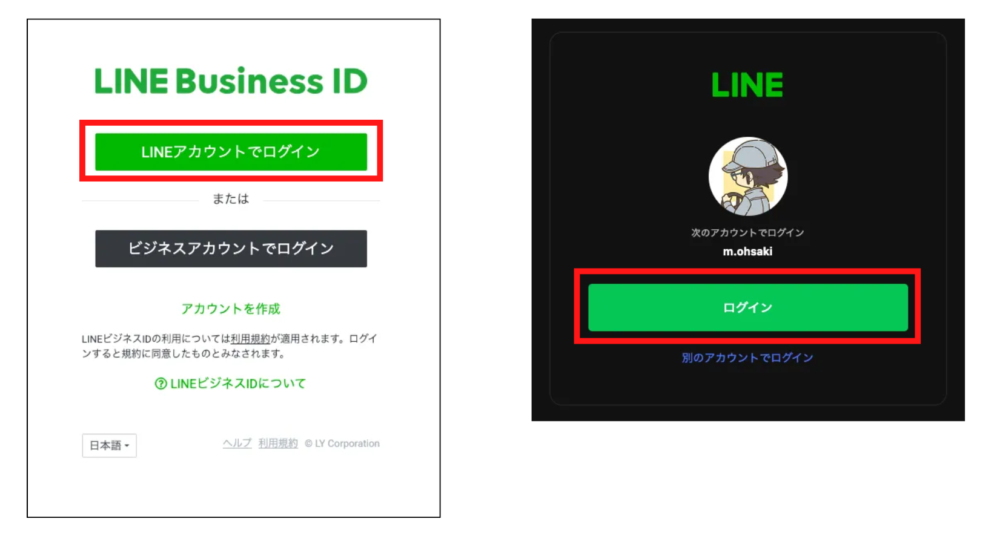
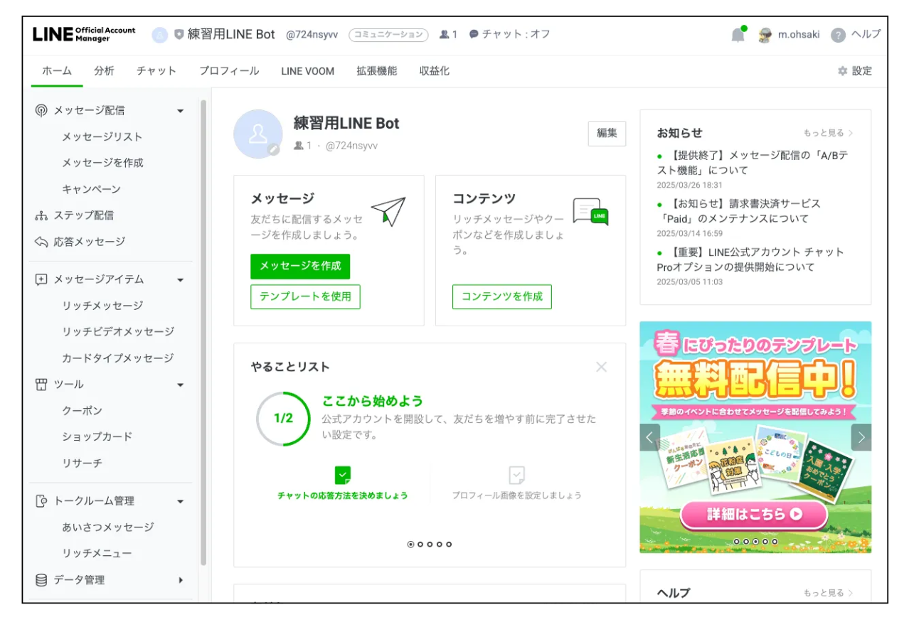

# LINE Botのデザインを整える

本ページでは、リッチメニューやあいさつメッセージ、プロフィールといったLINE BotのデザインをWeb管理画面上で設定する手順を説明します。

- [LINE Botのデザインを整える](#line-botのデザインを整える)
  - [LINE Official Account Manager](#line-official-account-manager)
  - [1. リッチメニューの設定](#1-リッチメニューの設定)
  - [2. あいさつメッセージの設定](#2-あいさつメッセージの設定)
  - [3. プロフィールの設定・変更](#3-プロフィールの設定変更)

## LINE Official Account Manager

本ページでは、[LINE公式アカウント作成](https://github.com/massa-potato/book-farming-line-bot/blob/main/02/02-1_line_official_account_manager.md)の際に用いた「LINE Official Account Manager」のWeb画面を操作して進めていきます。

まずは、[LINE Official Account Manager](https://account.line.biz/login)を開き、右上の「コンソールにログイン」をクリックします。

ログインが求められるので、自身のLINEアカウントでログインします。画面の指示にしたがって進めてください。もし、メールアドレスとパスワードの入力を求められた場合は、[こちら](https://github.com/massa-potato/book-farming-line-bot/blob/main/02/02-1_line_official_account_manager.md#1-line%E3%83%93%E3%82%B8%E3%83%8D%E3%82%B9id%E3%81%B8%E3%81%AE%E3%83%AD%E3%82%B0%E3%82%A4%E3%83%B3)の方法でログインを行ってください。

ログインが成功したら、アカウントリストが表示されます。以前作成したLINE Bot用の公式アカウント名をクリックします。

このような公式アカウントの管理画面が表示されたところから、以降の設定を進めていきます。

## 1. リッチメニューの設定

まずは、リッチメニューの設定手順を説明します。

アカウント管理画面の左のメニューバーから「トークルーム管理」を探し、その中の「リッチメニュー」をクリックします。

緑色の「リッチメニューを作成」ボタンをクリックします。

すると、リッチメニュー設定画面になります。まずは基本設定の項目で、下図のように「タイトル」と「表示期間」を記入します。

> 📝**補足メモ**  
> 表示期間は、リッチメニューが表示される開始時刻と終了時刻を入れる必要があります。これは公式アカウントを広報用に行う場合に、キャンペーン期間などによってメニューの表示を切り替えられるようにするためです。

LINE Botの運用ではリッチメニューは常に同じものを表示するケースが多いと思うので、開始時刻を現在より前の日に、終了時刻を10年後などに設定しておけば大丈夫です。

次に、コンテンツ設定の項目です。

テンプレートの「選択」ボタンをクリックすると、テンプレート選択ウィンドウが表示されます。目的に応じたものを選び、下の「選択」をクリックします。

次に、画像の「設定」をクリックして、リッチメニューに用いる画像を設定します。ここでは、事前に用意した[サンプル画像](https://github.com/massa-potato/book-farming-line-bot/blob/main/picture/menu.jpg)を用いて「背景全体の画像をアップロード」を選択して進めます。

> 📝**補足メモ**  
> もしメニュー画像を用意していなかった場合でも、ここで「エリアごとに画像を作成」をクリックすれば、この画面上でメニュー画像の作成が可能です。

ファイルを選択してアップロードすると、下図のように画像の編集ができる画面が現れます。必要に応じて編集を行い、最後に右上の「適用」をクリックしましょう。

次に、アクションを設定します。アクションはリッチメニューのボタンごとに設定します。下図を参考に設定してみてください。

タイプを選択する際には、いくつか選択肢が出てきますが、入力ツールとしてのLINE Botを制作する場合は「テキスト」か「リンク」のどちらかを使います。

最後に、メニューバー設定の項目はそのままで、一番下の「保存」をクリックします。

以上で、リッチメニューの設定が完了しました。

## 2. あいさつメッセージの設定

次に、あいさつメッセージの設定手順を説明します。

アカウント管理画面の左のメニューバーから「トークルーム管理」を探し、その中の「あいさつメッセージ」をクリックします。

すると、メッセージテキストを編集できるエディタとスマホのLINEアプリのプレビュー画面が表示された画面に切り替わります。

メッセージを編集し、右下の「変更を保存」をクリックしましょう。最後に出てくる確認画面で「保存」をクリックします。

> 📝**補足メモ**  
> メッセージの中には、送る相手に応じて表示が変わる「友だちの表示名」や「アカウント名」を埋め込むことができます。編集エディタ下部の「友だち表示名」「アカウント名」というボタンをクリックすると、その情報がメッセージ内に追加されます。

設定が完了しても画面は切り替わりません。右上に「保存しました」というポップアップが出ればOKです。

## 3. プロフィールの設定・変更

最後に、LINE公式アカウントの表示名やアイコンを変更する手順を説明します。

アカウント管理画面の右上の「設定」をクリックします。

すると「アカウント設定」の画面が表示されます。ここでアカウント名、ステータスメッセージ、プロフィール画像を必要に応じて編集しておきましょう。

> 📝**補足メモ**  
> これらのプロフィール設定を変更して保存する際に「今後1週間は変更できません」という警告が表示されます。変更前に内容をよく確認しましょう。

また、公式アカウントホームの上部メニューの「プロフィール」メニューからは、より詳細なプロフィール設定も可能です。ここではプロフィールページのカバー画像やアイコンの変更もできますので、こだわりたい場合はこちらもチェックしてみてください。

